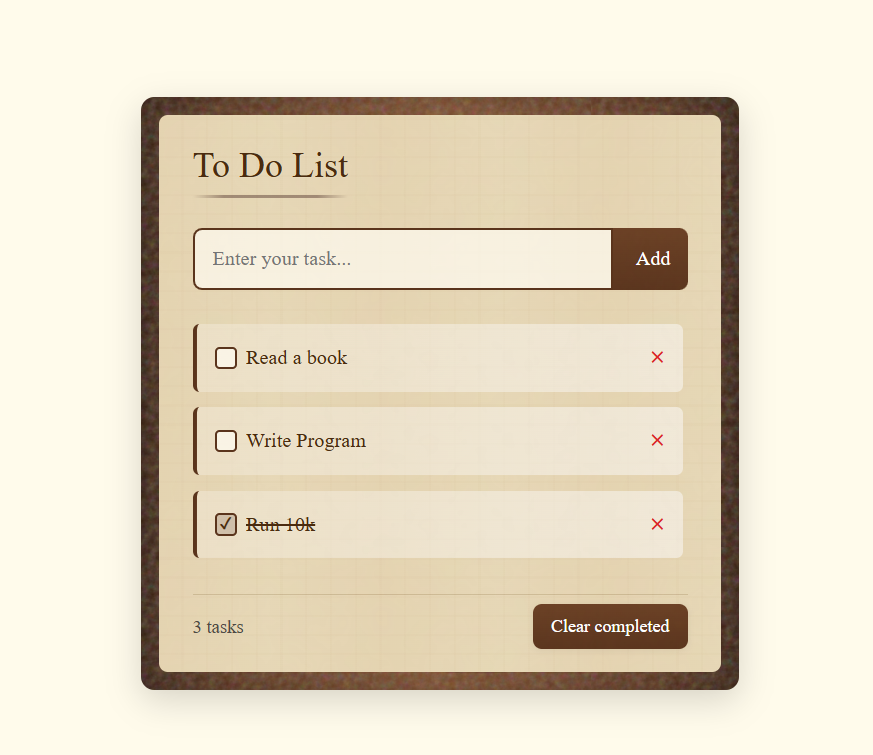

成品：https://wujiande.github.io/to-do-list

一個用 React + Vite 製作的任務管理小工具。

任務管理：支援新增、切換完成、刪除任務。
過濾功能：可依「全部」、「進行中」、「已完成」三種狀態篩選任務。
資料永續：所有任務自動儲存於 localStorage，重新整理或關閉網頁後依然保留。
時間戳記：每個任務都會自動記錄加入的時間。
現代 UI：採用 SCSS 打造美觀、易用的介面，並針對互動細節進行優化。
狀態集中管理：利用 Zustand 實現全域狀態管理，讓元件更簡潔、邏輯更清楚。

技術棧
React 18
TypeScript
Zustand（含 persist middleware）
SCSS
Vite