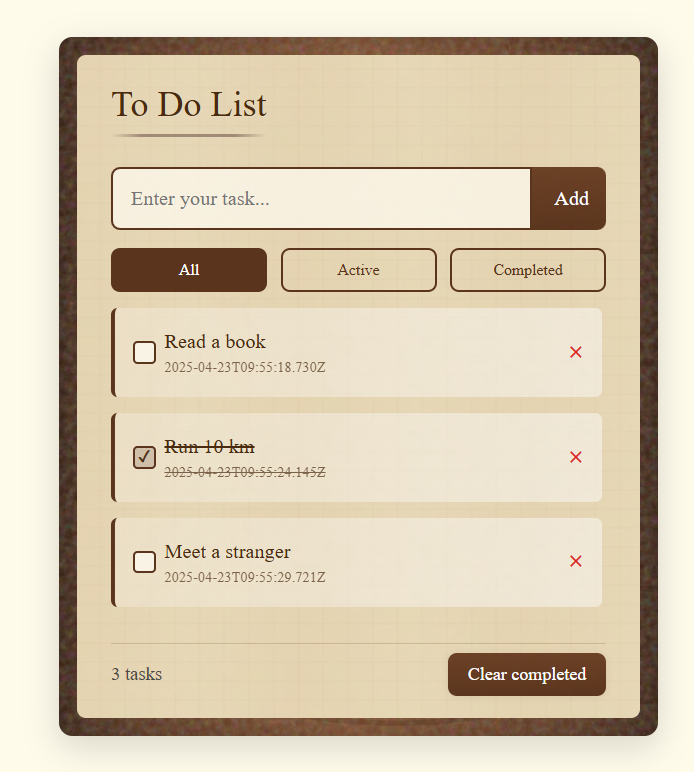

成品：https://wujiande.github.io/to-do-list

一個用 React + Vite 製作的練習作品。

**功能特色：**
- 支援任務的新增、完成狀態切換與刪除，讓待辦事項管理更直覺。
- 提供「全部」、「進行中」、「已完成」三種篩選模式，快速檢視不同狀態的任務。
- 任務資料自動儲存於 localStorage，頁面重整或關閉後依然保留，確保資料不遺失。
- 每個任務自動記錄建立時間，方便追蹤與回顧。
- 採用 SCSS 打造現代化 UI，兼具美觀與易用性，並針對互動細節優化體驗。
- 使用 Zustand 實現全域狀態管理，讓元件邏輯簡潔、維護容易。

**技術棧：**
- React 19
- TypeScript
- Zustand（含 persist middleware）
- SCSS（Sass）
- Vite
- ESLint、TypeScript ESLint
- PostCSS、Autoprefixer
- gh-pages（GitHub Pages 自動部署）
- @vitejs/plugin-react